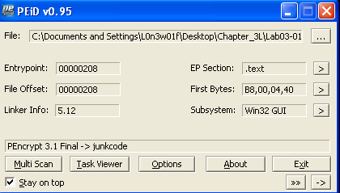
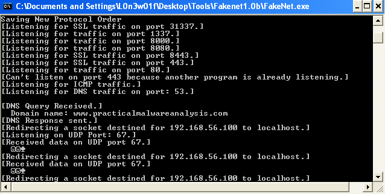
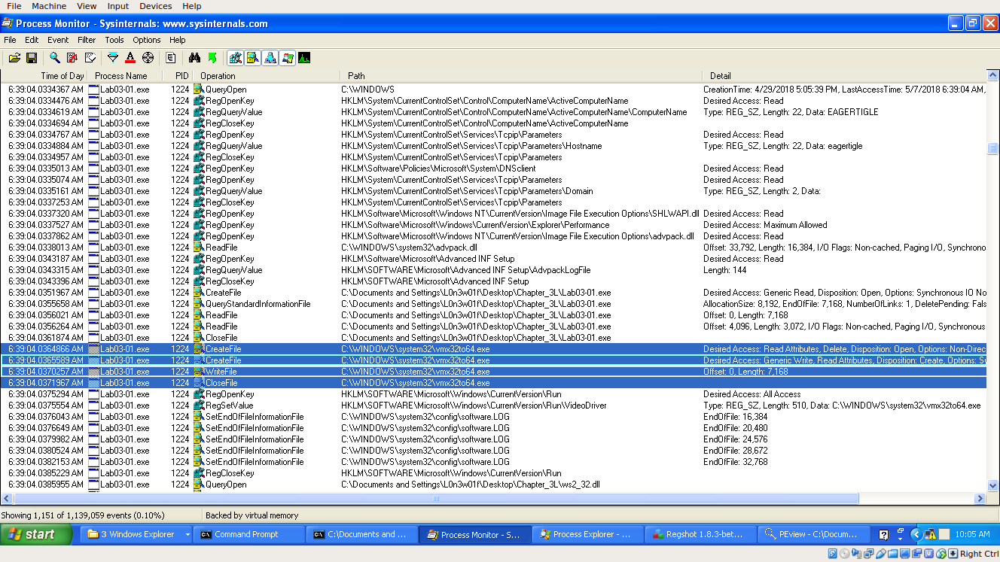
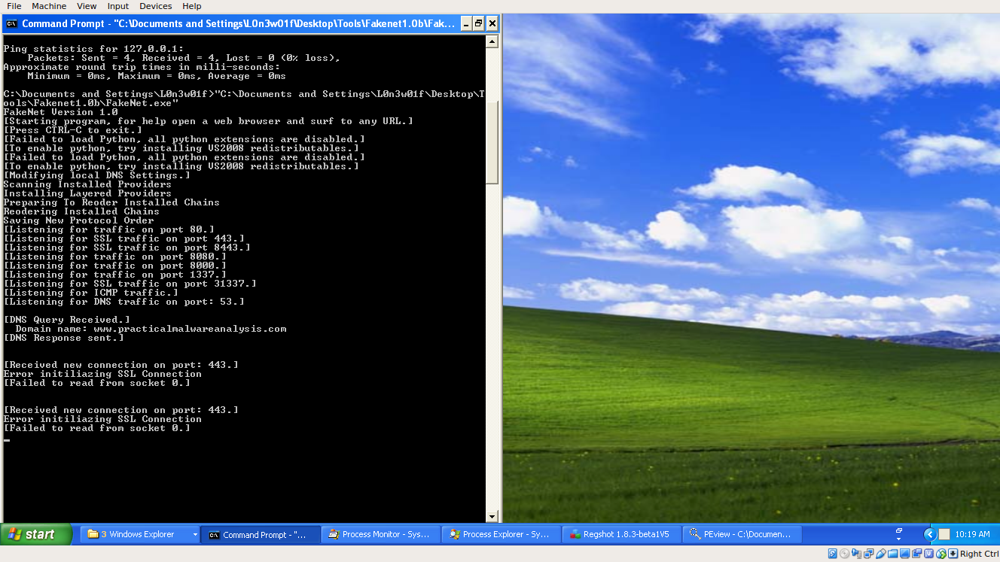
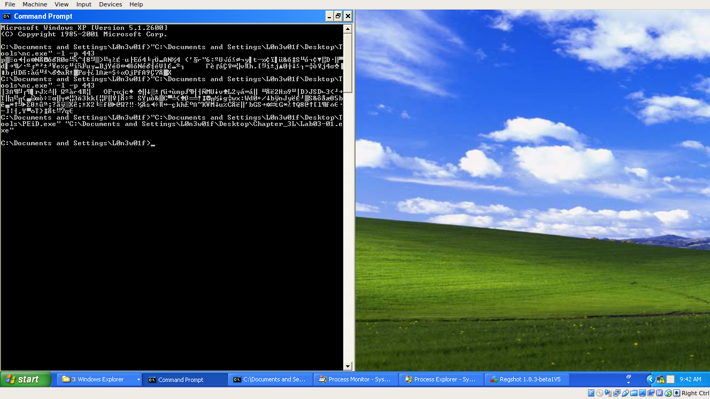
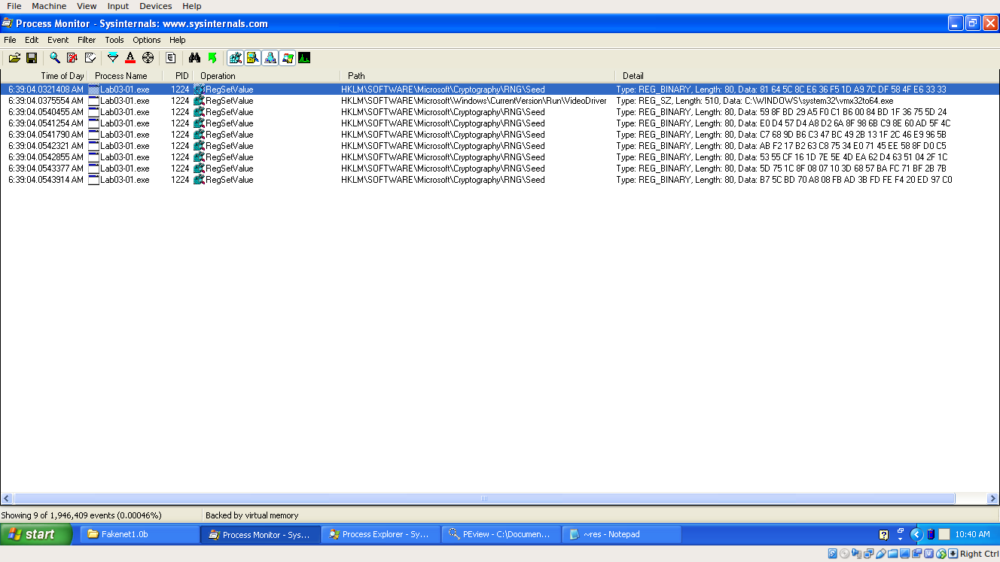
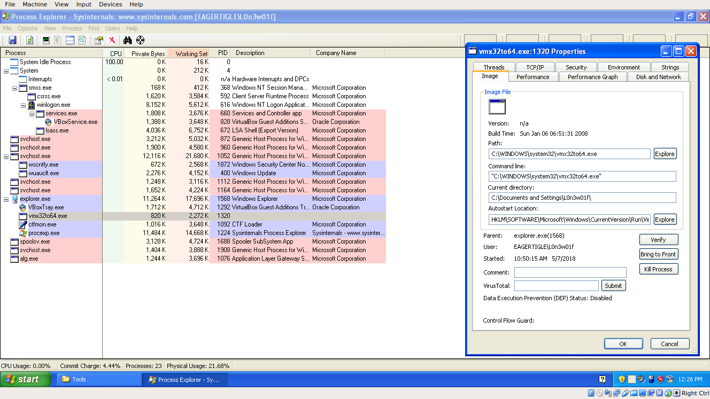

### Lab3-1

Analyze the malware found in the file Lab03-01.exe using basic dynamic analysis tools.

Questions
**1]** What are this malware’s imports and strings?
**Solution**: 
* Analyzing Lab03-01.exe using dependency walker, it seems that the Image is **obfuscated**. It is confirmed by PEiD's output: **PEencrypt 3.1 Final -> Junkcode** .
* But the strings seemed clear. These are strings which felt important.
	* advpack
	* StubPath
	* SOFTWARE\Classes\http\shell\open\commandV
	* Software\Microsoft\Active Setup\Installed Components\
	* test
	 * www.practicalmalwareanalysis.com
	* admin
	* VideoDriver
	* WinVMX32-
	* vmx32to64.exe
	* SOFTWARE\Microsoft\Windows\CurrentVersion\Run
	* SOFTWARE\Microsoft\Windows\CurrentVersion\Explorer\Shell Folders
	* AppData
	* ExitProcess
	* kernel32.dll
	* ws2_32
	* cks=u
	* ttp=
	* cks=
	* CONNECT %s:%i HTTP/1.0
	* advapi32
	* ntdll
	* user32

* Imports
	* ntdll.dll
	* kernel32.dll
	* advapi32.dll
	* rpcrt4.dll
	* secur32.dll
	* user32.dll
	* gdi32.dll
	* imm32.dll
	* lpk.dll
	* usp10.dll
	* advpack.dll
	* msvcrt.dll
	* ole32.dll
	* version.dll
	* setupapi.dll
	* shlwapi.dll
	* ws2_32.dll
	* ws2help.dll
	* WSPDII.dll
	* mswsock.dll
	* hnetcfg.dll
	* wshtcpip.dll
	* dnsapi.dll
	* iphlpapi.dll
	* winrnr.dll
	* wldap32.dll
	* rasadhlp.dll

**2]** What are the malware’s host-based indicators?
**Solution**:

*	Creation of a file named **vmx32to64.exe**  in **\WINDOWS\system32**.
*	Setting of this registry value: **HKLM\SOFTWARE\Microsoft\Windows\CurrentVersion\Run\VideoDriver**. This value has Data: **\WINDOWS\system32\vmx32to64.exe** .  The **Run** Registry key causes the specified program to run every time when the user logs in.

**3]** Are there any useful network-based signatures for this malware? If so, what are they?
**Solution** : 

*	The URL: **www.practicalmalwareanalysis.com**. As soon as the program is executed, it first tries to resolve this URL to get an IP Address. That is, it issues a **DNS Query**. 
*	The second one found is, the Malware tries to send some data through the **Port 443**. The data seems like , it is in another language. And the use of the DLL **lpk.dll**  has made this doubt even more strong.

## Detailed Analysis

### Basic Static Analysis

1. Output of VirusTotal.com:

*	**62/66** AV Engines classified it to be malicious. Many AVs classified it as a **Trojan Backdoor**.

2. Some conclusions based on the string present in the image.

* [Link to strings file](./strings/Lab03-01.exe.strings)
*	Looking at the number of functions and DLLs imported, it is mostly a obfuscated. But one strange thing is that all other strings are clear and make sense. PEiD showed that the image was encrypted.

*	**www.practicalmalwareanalysis.com** : This string is a URL, which is most likely to get resolved into an IP Address.
*	**SOFTWARE\Microsoft\Windows\CurrentVersion\Run** : This is very important **registry key**. Any program under this registry key is run **everytime a user logs on** into the system. This seems like something a Backdoor would do. Because, a Backdoor will be generally programmed in such a way that it gets connected to the attacker's machine asap. So, once the user logs in, a program is executed which will establish the backdoor connection again.
* **SOFTWARE\Microsoft\Windows\CurrentVersion\Explorer\Shell Folders** : A Shell Folder is a location used to store files a specific type. For example, if there is a mp3 file you are searching for, then My Music folder is the first folder the system searches. So, the **My Music folder is the Shell folder for muic files**. I am really not sure where this registry key has been used by the malware.
* **VideoDriver** , **WinVMX32-** , **vmx32to64.exe** : These are strings to look for during dynamic analysis.

4. Imports :

* According to strings, or Dependency Walker, the only function imported by this program is **ExitProcess** function of **kernel32.dll** .
* There are names of few DLLs as strings like **ntdll**, **user32** etc., but they do not give any imformation about the functions imported.
* Clearly, the Image is obfuscated and it is confirmed by PEiD. 

### Basic Dynamic Analysis

1. These are the things to do before starting dynamic analysis.
	*	Take a **screenshot** of the Clean OS, so that after all the analysis, we can revert back to this screenshot.
	*	Running **Procmon**(Process Monitor program) and setting a filter on the malware executable name and clearing all events just before running.
	*	Start **Process Explorer**
	*	Get a Snapshot of the Registry using **RegShot** before executing the malware program.
	*	Run the Program which will set up the Virtual Network. I did not get the right version of ApateDNS. So, a good alternative which I found is **FakeNet** written by authors of this book. So, run FakeNet.
	*	Start network logging using wireshark.
	*	**Run the Malware program**.

2. The first thing I noticed is that the program had requested for **DNS Resolution** of **www.practicalmalwareanalysis.com**. This can be seen on the FakeNet console. 
	

4. I searched for all the strings in Process Monitor output.
	* **vmx32to64.exe**:
		* A File has been created(**CreateFile** function) in this name in the **system32** directory. 
		* Something is written(**WriteFile** function) into the file. The start offset to write is 0, and length = 7168. Which means, the size of vmx32to64.exe file is **7168 bytes**. 
		* Just above the entries of this filename, the original malware program **lab03-01.exe** is opened and read completely(With offset = 0 and Length = 7168). So, the guess is that  vmx32to64.exe is nothing but Lab03-01.exe . It was verified and this guess is correct.
	

	*	**VideoDriver** : 
		* Just below the entries of creation , writing and closing of **vmx32to64.exe**, there are 3 Registry entries.(In the above image).
		* The first registry entry opens(**RegOpenKey**) the key **SOFTWARE\Microsoft\Windows\CurrentVersion\Run**.
		* The second sets the value of **SOFTWARE\Microsoft\Windows\CurrentVersion\Run\VideoDriver** to **\WINDOWS\system32\vmx32to64.exe**. 
		* And then the key is closed(**RegCloseKey**).
		* This simply means that the vmx32to64.exe, which is the actually the malware we are dealing with, gets executed everytime a user logs in into the system. **This is how the malware shows persistence**.
	* **WinVMX32** :
		* According to VirusTotal.com, it is the name of a Mutex created by the malware process.
		* Other than this, I did not get any lead with regard to this.

5. The wierd communication through **Port 443** :
	* FakeNet got a request on port 443. FakeNet is ready to accept the request, but there was error initializing the SSL connection.
	
	* So, I started listening using nc(**netcat**). This gave me some really useful stuff. 
	* The malware actually was sending some data and the length of that data was constant and equal to **256 bytes**.(Can check on Process Explorer). 
	* That data did not seem to be English(even if it is encrypted, it has got to contain english letters, but that is not the case). The fact that it has imported **lpk.dll** strengthens this argument. **LPK stands for Language Pack**.
	

6. **HKLM\SOFTWARE\Microsoft\Cryptography\RNG\Seed** :
	* This Registry value was set by the malware. I did not get much information about this on the net. But this might be helping the malware in decrypting the executable in real-time.(remember, it was an encrypted executable).
	

7. **Persistence of the malware** :
	* After a reboot, the malware as expected was running with the name **vmx32to64.exe**. 
	

