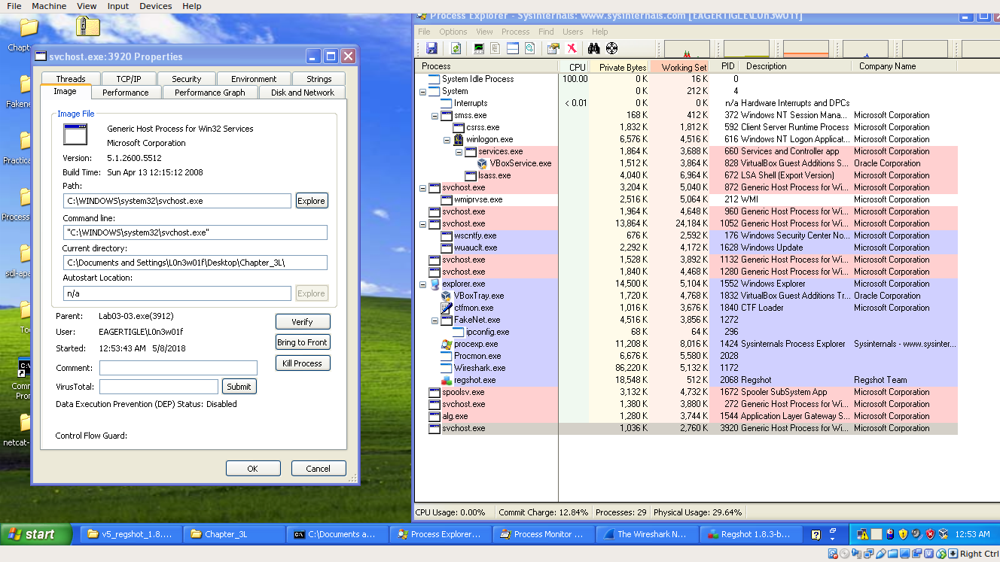
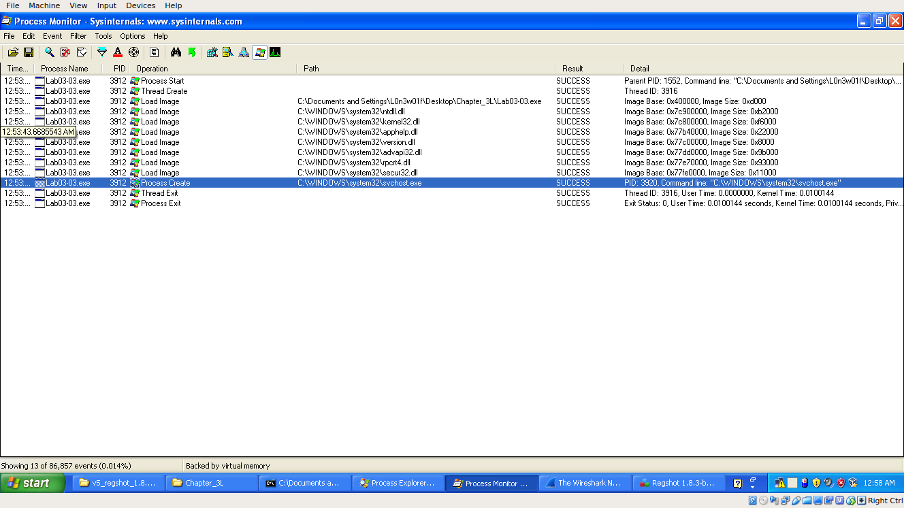
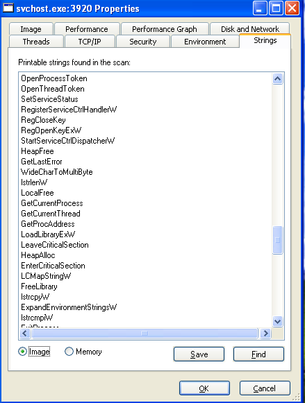
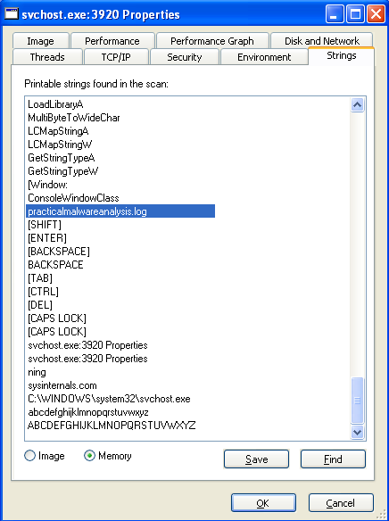
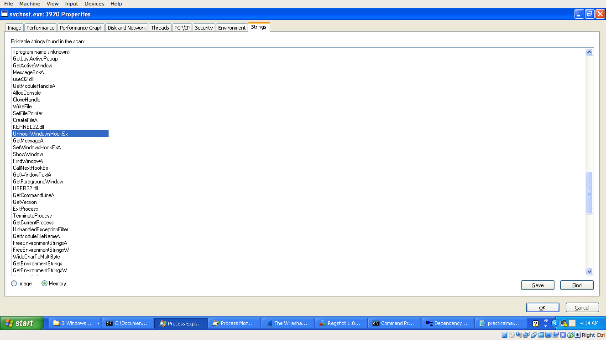
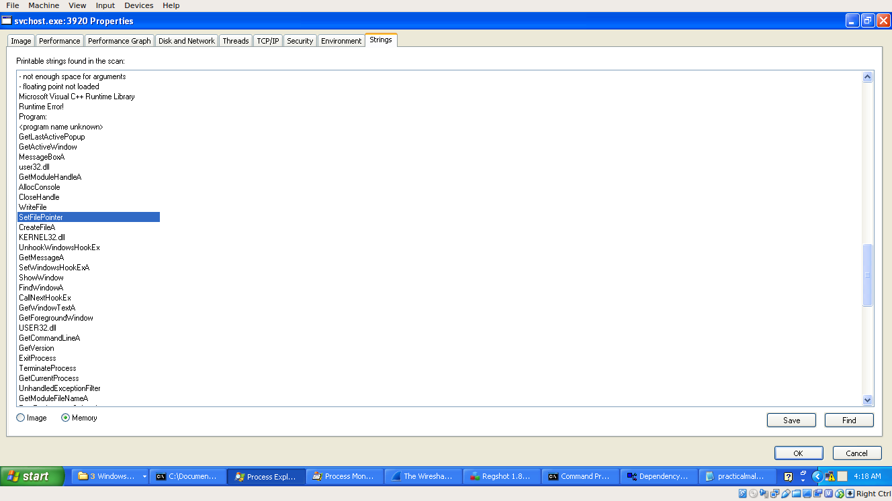
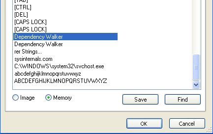
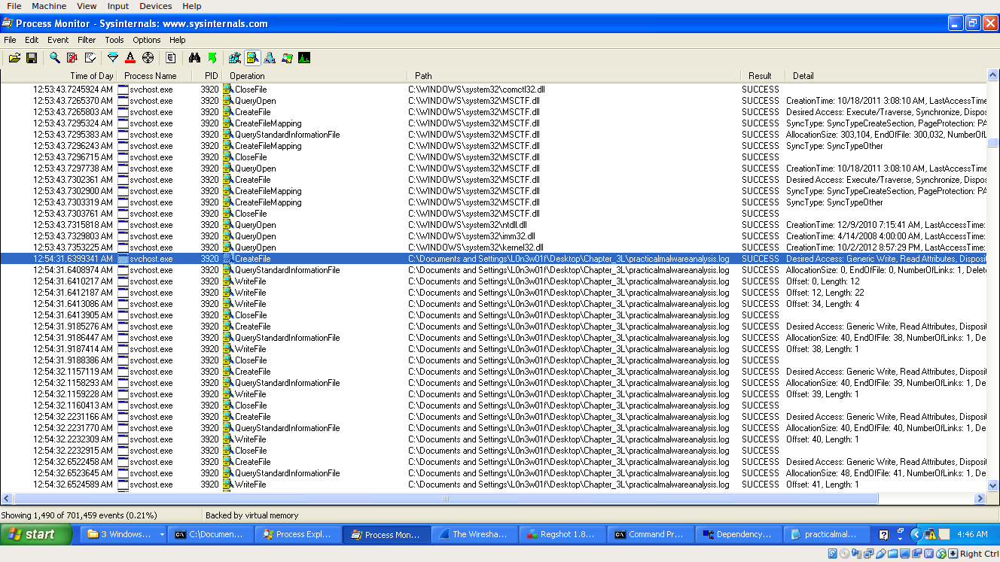
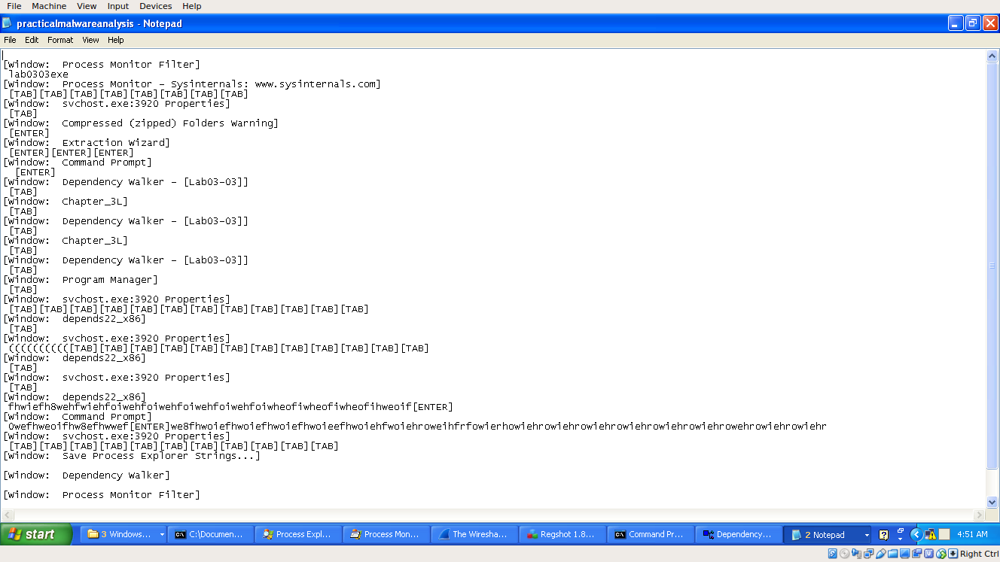

### Lab3-3

Execute the malware found in the file Lab03-03.exe while monitoring it using
basic dynamic analysis tools in a safe environment.
[Link to the malware sample](./samples/Lab03-03.exe)

Questions
**1]** What do you notice when monitoring this malware with Process
Explorer?
**Solution** : As soon as the malware Lab03-03.exe is executed, it **spawns** a new service **svchost.exe** and **terminates itself**.

**2]** Can you identify any live memory modifications?
**Solution** : 
While monitoring the service(background process) **svchost.exe** spawned by Lab03-03.exe, it continuously opens and writes in a file named **practicalmalwareanalysis.log**.

**3]** What are the malware’s host-based indicators?
**Solution** :
A log file named **practicalmalwareanalysis.log** . 

**4]** What is the purpose of this program?
**Solution** :
**Lab03-03.exe** prepares to spawn a service which is a **keylogger**.

### Detailed Anlysis

#### Basic Static Analysis

1. Output of VirusTotal.com:
	* 26/61 AV Engines classified this file as malicious.
	* A few of them classified it as **ExplorerHijack**.
	

2. Strings :
	[Link to strings file](./strings/Lab03-03.exe.strings)
	* Looking at the strings, the Image is clean and not obfuscated.
	* Looks like the author simply has put garbage into the image. Maybe to confuse the analysts.

3. Functions Imported:	
	* A few imports which felt important :
		* **CreateProcess** : Maybe Lab03-03.exe creates a new process.
		* **ExitProcess**: It will probably terminate itself at some point.
		* **WriteFile** : Writes into a file. This could probably be an indicator.
		* There are the **Heap** functions used. This is probably normal.
		* **LoadLibrary** and **GetProcAddress** : The 2 functions used to call functions during **run-time**. If these are used, the functions called at run-time wont get reflected during static analysis.

#### Basic Dynamic Analysis

1. The first event observed was that Lab03-03.exe **spawned** a service(**background process**) - svchost.exe and terminated itself.

##### Focusing more on the service spawned by Lab03-03.exe.

2. **svchost.exe** :
* Strings of **svchost.exe** say a lot about it.
	* In Process Explorer->Strings option, there are 2 options **Image** and **Memory**. Image option gives all the strings of the executable file present on the disk(Secondary memory). Memory option gives all the strings of the image in main memory. Ideally, if it was a legitimate program, strings of both the options have to be exactly same because the file on the disk is loaded into the main memory for execution.

	* But, here the strings are entirely different. **IMP**
	* The strings of the Image suggest that the program is a legitimate one, does not use any doubtful functions, wierd strings, names of websites, Ip Addresses or anything.
	* But the Strings of the Memory exposes the real color of svchost.exe .
	* It shows that the service(svchost.exe) has imported many doubtful functions(explained in the Functions Imported section).
	* It also has a string **practicalmalwareanalysis.log** . This is mostly the log file the keylogger is logging everything into. **IMP**
	* 	It also has strings like **[SHIFT]**, **[ENTER]**, **[BACKSPACE]**, **[TAB]**, **[CTRL]**, **[DEL]**, **[CAPS LOCK]** which is seems like a method to log **non-printable** keys onto the log file.
	
* Functions imported by the malware
	* It has used many Hook functions like **SetWindowsHookExA**, **UnhookWindowsHookEx**, **CallNextHookEx** which are general indicators of a Keylogger.
	
	
	* It has also imported functions like **CreateFIle**, **WriteFile**, **SetFilePointer** which are used to write into a file at the right position. The SetFilePointer is used especially when there is already something written and we have to find the proper offset from the beginning to start writing.
	
	
	* It also uses functions like **GetActiveWindow**, **GetWindowText**, **GetForegroundWindow** which specifically focus on the window the user is working on. 

* A keen observation of what is being stored by the keylogger.
	* Everytime the active window changes, the keylogger stores the details about the most recent active window. In the following image,
	
	
* Monitoring the malware using Process Monitor
	* The main focus is on the **File System Activity** because it is a keylogger. We want to know what all it is logging, where is log file(**practicalmalwareanalysis.log**) located in the system, is it hidden etc.,
	* Applying the **File System Activity** Filter, the first few entries showed the DLLs it imported.
	* The most interesting part came when I saw these entries.
	
	*	The above image shows that the keylogger continuously Opens the file(**CreateFile** function), logs / writes into the file(**WriteFile** function) and closes the file(**CloseFile**).
	*	All the entries after those shown in the above image are the **LOGGING** entries. 
	*	Check out the log file.
	
* Something to think about:
	* What was most suspicious and surprising is that this keylogger did not communicate with another machine. 
		* There were no Network related DLLs(**WS2_32.dll**, **WININET.dll** etc.,) imported.
		* Even if there was some hidden connectivity, FakeNet would have given the results.

* After Computer Restart:
	* This was done to check the persistence of the keylogger. Because during the analysis, we did not find any method that keylogger had used(eg: Setting the Run registry key) which makes it persistent.
	* This keylogger is **not persistent**. It gets wiped out once the machine is rebooted.
	* And the image of the keylogger(scvhost.exe) on the disk is the copy of image of a legitimate service. 

**Conclusion** :
	
* Lab03-03.exe is only a program which will drop a keylogger into the system as a service which silently runs in the background.

* Dynamic Analysis has made the analysis far more deep and efficient. This type of dissection would not be possible with basic static analysis because we had to analyze an entirely different executable. The executable(Lab03-03.exe) was never the focus during the analysis.