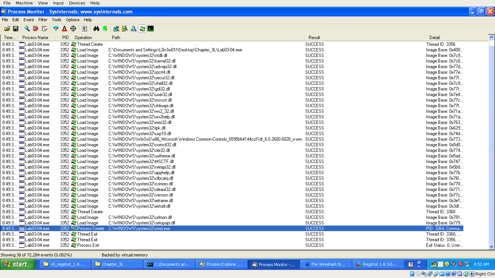
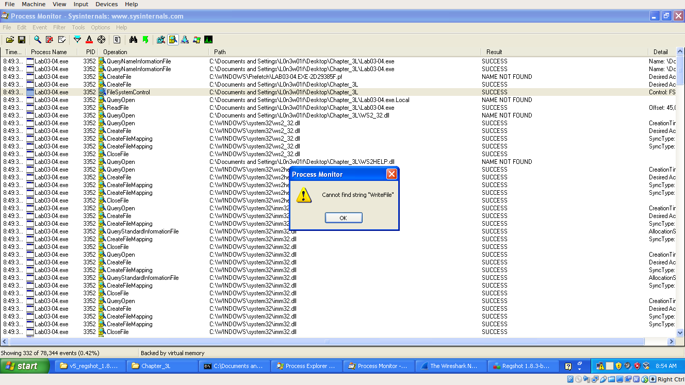
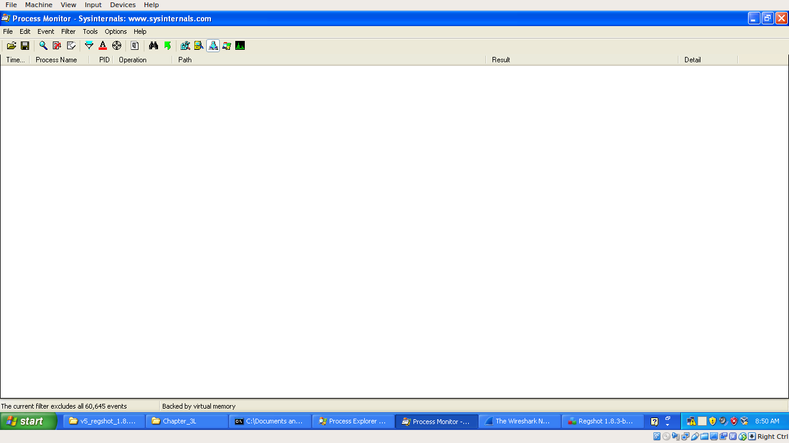

### Lab03-04

Analyze the malware found in the file Lab03-04.exe using basic dynamic analysis tools. (This program is analyzed further in the Chapter 9 labs.)

[Link to the sample](./sample/Lab03-04.exe)

Questions
**1]** What happens when you run this file?
**Solution** : 
When the file is run, it runs cmd.exe for a moment and then terminates .
It also deletes it's on-disk image.

**2]** What is causing the roadblock in dynamic analysis?
**Solution** : 
2 things.

* The malware delete's it's on-disk image when run. So, the original executable file is lost.
* The malware terminates after running for a few moments.

How are they thwarting analysis?

* No comparision between on-disk image and one in memory can be done. As seen in Lab03-03 sample, the On-disk image was entirely different from the one loaded into the memory. So, we wont get to know the true colors of malware once it is loaded into memory.

**3]** Are there other ways to run this program?
**Solution** : 
Did not find any other ways to run it such that it exhibits it's true functionality.

### Detailed Analysis

#### Basic Static Analysis

1. Output of VirusTotal.com :
	* 38/65 AV Engines classified it to be malicious.
	* A Few of them classified it as a Downloader.
	
2. Strings in the executable: [Link to the strings file](./strings/Lab03-04.exe.strings)

	*	Configuration
	*	SOFTWARE\Microsoft \XPS
	*	\kernel32.dll
	 *	HTTP/1.0
	*	GET
	*	NOTHING
	*	DOWNLOAD
	*	UPLOAD
	*	SLEEP
	*	cmd.exe
	 *	**>>** NUL
	*	/c del
	*	http://www.practicalmalwareanalysis.com
	 *	Manager Service
	*	.exe
	*	%SYSTEMROOT%\system32\
	*	k:%s h:%s p:%s per:%s
	*	Program:
	*	program name unknown
	*	SunMonTueWedThuFriSat
	*	JanFebMarAprMayJunJulAugSepOctNovDec
	*	.com
	*	.bat
	*	.cmd

* **HTTP/1.0** suggests that it uses HTTP Protocol to communicate with the attacker machine.
* **http://www.practicalmalwareanalysis.com** : This seems like a URL which can be part of network signature.
* **NOTHING**, **DOWNLOAD**, **UPLOAD**, **SLEEP** : Could be some type of commands to control the malware.
* There are a lot of other strings from which I am not able to conclude anything solid.

3. Imports :
	* **WS2_32.dll** : This confirms that the malware has network functionality.
	*  There are many important functions imported from KERNEL32.dll.
		* **WriteFile**, **CopyFile** , **DeleteFile**, **SetFilePointer** .
	*	Most important are the imports from **ADVAPI32.dll** :
		*	**RegSetValue**,	**RegCreateKey**,	**RegDeleteValue** suggest that this malware makes changes in the Registry.
		*	**CreateService**, **OpenSCManager** and many other service related functions suggest that it might spawn a service which silently runs in the background.
		*	**ShellExecute** function from SHELL32.dl suggest that it executes some commands.
	
	The malware seems to have a lot of functionalities. 

#### Basic Dynamic Analysis

1. Just as the malware was executed, it ran **cmd.exe** and terminated itself and cmd.exe. ->Observed on Process Explorer.

2. There are so many functions imported by it, which was seen in Static analysis. When analyzing the output of Process Monitor, **But none of the Registry value changing functions,  File functions(Especially WriteFile and SetFilePointer) were used**.

3. Though static analysis suggested network functionality, there was **nothing**.

4. That there is some method to enable the malware. Could be a HotKey, or a command line argument. But did not get anything as of now.
